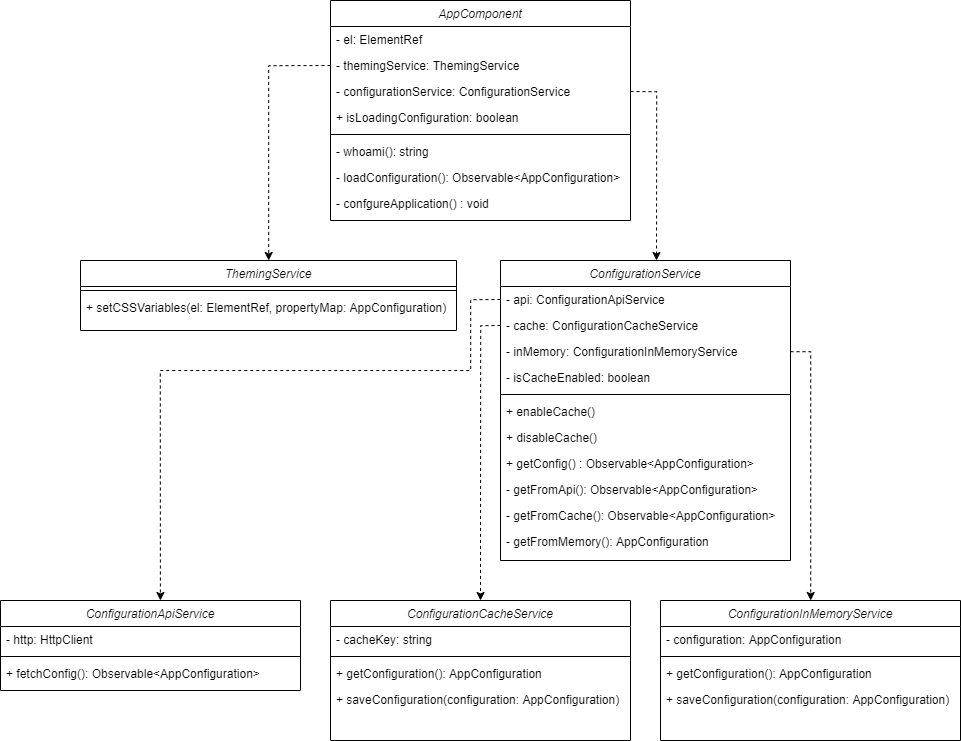
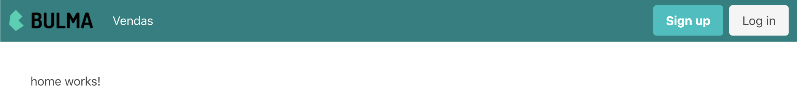
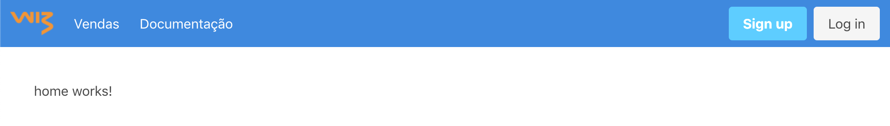

<!-- omit in toc -->
# Wiz Angular White Label Schematic

- [Sobre](#sobre)
- [Uso](#uso)
- [Sobre a aplicação gerada](#sobre-a-aplicação-gerada)
  - [Arquitetura white-label](#arquitetura-white-label)
    - [Diagrama de classes](#diagrama-de-classes)
    - [AppComponent](#appcomponent)
    - [ThemingService](#themingservice)
    - [ConfigurationService](#configurationservice)
    - [ConfigurationApiService](#configurationapiservice)
    - [ConfigurationCacheService](#configurationcacheservice)
    - [ConfigurationInMemoryService](#configurationinmemoryservice)
  - [Experimente](#experimente)
    - [Instale as dependências](#instale-as-dependências)
    - [Rodando o servidor de teste](#rodando-o-servidor-de-teste)
    - [Exemplos](#exemplos)
      - [Exemplo 1](#exemplo-1)
      - [Exemplo 2](#exemplo-2)
  - [Estrutura e recursos](#estrutura-e-recursos)
- [Desenvolvimento do schematic](#desenvolvimento-do-schematic)
  - [Por onde começar](#por-onde-começar)
  - [Testando o schematic localmente](#testando-o-schematic-localmente)
    - [1. Gere um distribuível do schematic](#1-gere-um-distribuível-do-schematic)
    - [2. Gere uma nova aplicação e instale e execute o schematic](#2-gere-uma-nova-aplicação-e-instale-e-execute-o-schematic)
  - [Aprenda mais sobre schematics](#aprenda-mais-sobre-schematics)

## Sobre
Schematic para gerar código boilerplate com a [arquitetura de referência para aplicações Angular "white label"](https://github.com/wizsolucoes/angular-white-label).

Compatível com as [versões suportadas do Angular](https://angular.io/guide/releases#support-policy-and-schedule) (^8.0.0, ^9.0.0 e ^10.0.0) e otimizado para as versões ^10.0.0.

## Uso

```bash
# Generate a new angular application
ng new my-app --style=scss

# Enter the directory
cd my-app

# Add white label arquitecture
ng add @wizsolucoes/angular-white-label
```

**IMPORTANTE: Este schematic supõe que a aplicação usa SASS e deve ser executado em projetos novos, pois faz a sobrescrita de arquivos.**

## Sobre a aplicação gerada
### Arquitetura white-label

#### Diagrama de classes



#### AppComponent

O componente base da aplicação Angular. O componente usa a url para se identificar, solicita sua configuração do serviço de configuração e delega a customização visual ao serviço de tema.

O método `whoami` e responsável por identificar o _tenant_ baseado na url da aplicação.

#### ThemingService

Serviço de tema responsável por aplicar configurações visuais ao DOM.

#### ConfigurationService

Serviço de configuração que é efetivamente um repositório dos dados de configuração, no sentido do *repository pattern*. *ConfigurationService* tem como dependência *ConfigurationInMemoryService*, *ConfigurationCacheService*, *ConfigurationApiService* que servem como fontes de dados.

O serviço de configuração consulta os dados na seguinte ordem de preferência:
1. Dados em memória
2. Dados em cache, se o cache estiver habilitado
3. API

O uso do cache pode ser habilitado e desabilitado pelo serviço de configuração.

Os dados sempre são guardados em memória após consulta independente da fonte.

De forma geral, este é o serviço que deve ser injetado nos componentes da aplicação que dependem de configuração.


#### ConfigurationApiService
Serviço responsável por fazer uma requisição **http** para buscar a configuração.

#### ConfigurationCacheService
Serviço responsável por usar o **local storage** para buscar e guardar a configuração.

#### ConfigurationInMemoryService
Serviço responsável por buscar e guardar a configuração **em memória**.

### Experimente
A aplicação angular *starter* faz uma requsição `GET` para `http://localhost:3000/config/:tenantId` para buscar a configuração. O projeto tem um [`json-server`](https://github.com/typicode/json-server) que pode ser usado para responder essa requisição.

#### Instale as dependências
```
npm install
```

#### Rodando o servidor de teste

Em um terminal rode o servidor:
```
npm run server
```

Em outro terminal rode a aplicação Angular:
```
npm start
```

Para mudar as respostas do servidor e visualizar como a aplicação se comporta, modifique o arquivo [/server/db.json](./server/db.json) e atualiza a página do browser onde a aplicação está rodando.

#### Exemplos
Repare nos exemplos a seguir como o tema, a logo e a disponibilidades de funcionalidades são configurados de acordo com o a url da aplicação e o conteúdo do arquivo [/server/db.json](./server/db.json).

##### Exemplo 1
Se a aplicação estiver roando em http://localhost:4200/, o objeto de configuração que o servidor retorna é:

```json
{
  "id": 4200,
  "theme": {
    "primary-color": "teal"
  },
  "logoImageUrl": "https://bulma.io/images/bulma-logo.png",
  "features": ["sales"]
}
```


##### Exemplo 2
Se a aplicação estiver roando em http://localhost:8080/, o objeto de configuração que o servidor retorna é:
```json
{
  "id": 8080,
  "theme": {
    "primary-color": "#1E88E5"
  },
  "logoImageUrl": "https://raw.githubusercontent.com/wizsolucoes/angular-white-label/master/docs/logowiz.png",
  "features": ["sales", "documentation"]
}
```



### Estrutura e recursos
A estrutura da aplicação segue a estrutura da arquitetura de referência para aplicações Angular e tem os mesmos recursos. Leia mais aqui: https://github.com/wizsolucoes/angular-starter-schematic#sobre-a-aplicação-gerada


## Desenvolvimento do schematic
### Por onde começar
```bash
# Instalar as dependências
npm install

# Buildar schematic
npm run build

# Executar os testes
npm test
```

### Testando o schematic localmente
#### 1. Gere um distribuível do schematic

```bash
# Instalar as dependências
npm install

# Buildar schematic
npm run build

# Gerar tarball eg. wizsolucoes-angular-white-label-1.0.1.tgz
npm pack
```

#### 2. Gere uma nova aplicação e instale e execute o schematic

```bash
# Gerar uma nova aplicação Angular em outra pasta para testar o schematic
ng new my-app --style=scss

# Entrar na pasta da nova aplicação
cd my-app

# Instalar schematic
npm i --no-save ../path/to/angular-white-label-schematic/wizsolucoes-angular-white-label-1.0.1.tgz

# Executar schematic
ng g @wizsolucoes/angular-white-label:ng-add
```

### Aprenda mais sobre schematics
- [Generating code using schematics](https://angular.io/guide/schematics)
- [Total Guide To Custom Angular Schematics](https://medium.com/@tomastrajan/total-guide-to-custom-angular-schematics-5c50cf90cdb4)